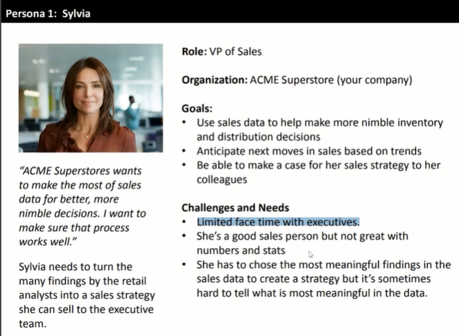

# TABLEAU

[Version en notion](https://www.notion.so/TABLEAU-f70d2caa64d7471987ed000fefdb0475) 

## INTRODUCCIÓN

### Visualización de datos

La visualización de datos nos ayudará a encontrar la información pertinente y relevante, así como a la organización de la información.

La visualización de datos es una representación gráfica de la información, y esta puede ser dividida en 2 partes:

- Input: La parte que inicia el proceso, en nuestro caso los datos a graficar.
- Output: El producto, en este caso las visualizaciones, o DataViz.

La visualización de datos es tan antigua como los ábacos. La mejor visualización de la historia es la infografía sobre la marcha de Napoleón, porque:

- Muestra la transición de la marcha del ejército de Napoleón, hacia la conquista de Moscú
- Representa el tamaño del ejército de Napoleón a lo largo de la marcha.
- Indica la ubicación geográfica a lo largo de la marcha.
- Muestra la temperatura que hubo en diferentes etapas de la marcha.
- Señala los ríos que se cruzaron en el trayecto de la marcha.

### Herramientas de visualización de datos

Excel:

- La primera herramienta que normalmente se conoce como visualizadora, muy usada en el mundo corporativo
- Forma parte de la suite de Microsoft Office
- Con un poco de trabajo puedes construir dashboards

Power BI:

- La transición natural de Excel hacia el Business Intelligence
- Al ser un producto de Microsoft es compatible con la suite de Microsoft Office
- Viene en dos versiones: de escritorio y web (aunque la versión web viene con limitaciones), además de que tiene versión gratuita
- Te permite fácilmente hacer reportes, usando dashboards

Google Analytics:

- Utilizada principalmente en Marketing Digital
- Útil para ver el comportamiento de campañas, anuncios o costo por clic
- Es más complicado de generar visualizaciones personalizadas, siendo el tablero predeterminado la única forma de visualizar

Tableau:

- Te permite generar dashboards, pero además generar una narración de historia
- Tiene una gran comunidad que se apoya entre sí, además de que realiza eventos como IronViz o Makeover Monday (en Twitter)
- Cuenta con tres versiones:
    1. Desktop (de paga)
    2. Public (gratuita)
    3. Server (para empresas)
- Es la herramienta más completa

## TABLEAU

[Atajos de teclado](https://help.tableau.com/current/pro/desktop/es-es/shortcut.htm)

En Tableau podemos importar archivos con datos en diferentes formatos:

- Excel
- Texto
- JSON
- Access
- PDF
- Archivos espaciales
- Archivos estadísticos

Una vez te entres en la Hoja de Trabajo, a la izquierda se mostrarán las columnas, los valores de las columnas pueden ser:

- Discretos (mostrados en azul). Son los considerados finitos.
- Continuos (mostrados en verde)

Tableau es muy fácil de utilizar, ya que funciona arrastrando y soltando los datos que necesites para tu visualización.

Puedes arrastrar los valores a las columnas y filas que quieras mostrar. Sistema Drag and drop.

En el botón mostrarme (arriba a la derecha) elige el tipo de gráfica con la que desees visualizar tus datos.

Puedes intercambiar filas y columnas usando el botón Intercambiar (en la sección de Herramientas).

### Recomendaciones:

- Muestra los datos de forma descendente.
- Cambia el color de cada elemento **arrastrando los datos** seleccionados a la **opción color**, en la sección marcas. Tableau respetará los colores, en caso de que hagas más de una *DataViz* usando los mismos datos.
- También puedes agregar **etiquetas**, **mensaje emergente**, etc. Desde la sección **marcas**, así como modificar el ancho de las barras.

### Dashboard

Un Dashboard o tablero es un conjunto de visualizaciones de datos, generalmente usados para hacer Reportes, y hacer enfoque en las DataViz más importantes.

- Antes de generar un dashboard es necesario crear las visualizaciones necesarias.
- Es importante nombrar cada visualización apropiadamente.
- Haz un duplicado de cada visualización. Esto evitará que pierdas los avances ya hechos.
- Dar clic en Nuevo Dashboard (parte inferior).
- En la parte izquierda encontrarás todas las visualizaciones hechas.
- Se recomienda establecer el tamaño del dashboard como Automático, para que se expanda a toda la pantalla.
- Arrastra las visualizaciones (drag and drop), utilizando el posicionamiento que Tableau proporciona.
- Tableau también proporciona distintos objetos para ayudarte a mejorar la visualización de tu dashboard.

Una de las partes más importantes y que también puedes aprovechar es la comunidad, es una de las comunidades más importante dentro de la visualización de datos.

Makeover Monday: Evento que sucede cada lunes en Twitter (#MakeoverMonday). Es una excelente forma para obtener visualización dentro de la comunidad de Tableau.

Viz of the Day: Es la visualización más votada del día por la comunidad. Puedes encontrarla desde tu perfil de Tableau Public.

Iron Viz: Para participar debes haber recibido una nominación general de parte de la comunidad. Los participantes de Iron Viz antes participaron en Makeover Monday.

Kaggle: Una comunidad en la que se comparte todo tipo de datasets públicos, y en donde puedes compartir proyectos, visualizaciones y análisis de los datasets.

### Mejores prácticas de diseño

- Agrupar las visualizaciones relacionadas
- Mantener la percepción de las visualizaciones en los ejes **x** y **y** (sesgo de la percepción visual)
- Respetar los colores de cada elemento y evitar reusarlo
- Ordenar los valores de manera descendente
- Colorear las barras de forma que las más grandes tengan un color más saturado, y las más pequeñas un color con menor saturación
- Resaltar un elemento cuando haya información relevante (ej. pérdidas en producción)
- Debe haber continuidad en los valores, a menos que esto represente algo (ej. inicio del año)
- Dependiendo si tu dashboard es dinámico o estático, usa o evita el uso de visualizaciones que necesiten scroll o hover
- Evitar el empleo de elementos que confundan

## DEFINE LA AUDIENCIA Y OBJETIVO DE TU VISUALIZACIÓN

Para conocer el propósito de nuestra visualización, debemos conocer al público que la presentaremos, para así preparar nuestra visualización y dar el mensaje correcto con las palabras correctas.

### Objetivo de tu visualización

- ¿Qué mensaje queremos dar?: Cual es el mensaje que tenemos queremos dar para saber que visualización se adecua a este propósito
- ¿Qué DataViz es el mejor para nuestros datos?
- ¿Cuáles son las preguntas que vamos a responder?
- ¿La DataViz será dinámica o estática?

### Define tu audiencia

- ¿Quiénes son?: Debes saber que lenguaje y terminologías utilizan y con que dava viz están relacionados para reducir la carga cognitiva de nuestro público.
- ¿Qué lenguaje hablan?
- ¿Con qué DataViz están acostumbrados?
- Define un Perfil Persona (nombre, rol, organización, metas, retos y necesidades): El objetivo de esto es adelantarse a que preguntas podría tener y cuales son sus necesidades con respecto a nuestro dataviz
- Define cuáles son las preguntas, dudas y preferencias que el Perfil Persona tiene
- ¿Cómo lo haré?: Será estática o dinámica, dependerá de la situación en que mostremos nuestros resultados, a la persona que se los mostremos y el tiempo que tengamos para mostrarlo, para saber si requerimos de filtros dinámicos y otros atributos similares

Ejemplo de perfil persona:

### Ética en la visualización de datos

- No hay lugar para nuestras preferencias personales
- Debemos dejar que los datos hablen por sí mismos
- Una vez perdamos nuestra credibilidad, es difícil recuperarla

## TIPOS DE GRÁFICOS

### Gráfica de barras

- Es recomendable no usarlo cuando tengamos que comparar más de dos variables.

### Gráfico de dispersión

Nos ayuda a encontrar la correlación entre 2 variables.

### Formato de tabla

El formato de tabla es muy útil para ver información que nos pueda ser pertinente, y utilizando colores adecuadamente, ayuda a reducir la carga cognitiva.

### Fechas y gráficas de líneas

Las líneas generalmente se utilizan para mostrar los datos que pasan en un rango de tiempo.

### Mapas con filtros, parámetros y KPIs

Con Tableau podemos hacer representaciones visuales de datos con mapas, si tienen un mundo antes del nombre de la propiedad, significa que son un tipo de dato geo localizado, es que este dato puede ser representado en un mapa.

En los KPIs es importante que los valores que no nos interesan se pinten de un color neutro, como el gris, y resaltar los valores que son pertinentes (con un color saturado, como el rojo)

Un filtro nos ayuda a mostrar solamente la información que queremos.

### Tableros interactivos con acciones y filtros

1. Creamos nuestro dashboard con las hojas necesarias.
2. Eliminamos los colores ya que nosotros sabemos qué significa cada color
3. Ocultamos los títulos no necesarios
4. Si dejamos el título, podemos eliminar la etiqueta de la barra Y si sale en el título.
5. Usamos los objetos para dejar nuestro dashboard más presentable
6. Para hacer nuestro tablero interactivo podemos agregarle algunas acciones.
    1. Tienes que ir a:
    
    dashboard > acciones > añadir acción > filtro
    
    Esto, nos permite que se apliquen filtros de forma automática a todas nuestras gráficas que lo contengan en el db.
    

Los objetos nos permiten agregar cosas como:

- Espacios en blanco
- Texto
- Imágenes
- Páginas
- Etc.

### Tablas y gráficas de burbujas

Un gráfico de burbujas es una variación de un gráfico de dispersión en el que los puntos de datos se reemplazan por burbujas y una dimensión adicional de los datos se representa en el tamaño de las burbujas. Al igual que un gráfico de dispersión, un gráfico de burbujas no usa un eje de categoría: tanto los ejes horizontales como los verticales son ejes de valor. Además de los valores x e y que se trazan en un gráfico de dispersión, un gráfico de burbujas traza valores x, valores y y valores z (tamaño).

### Mapas en árbol y mapas de calor

Los mapas en árbol, o «treemap», no son más que unos rectángulos anidados. Son muy útiles para representar datos de una estructura jerárquica. Las jerarquías representan dimensiones.

Los mapas de calor se usan para ayudar a identificar patrones y cambios. Aunque se pueden usar para mostrar cambios a lo largo del tiempo, no están pensados para un análisis detallado.

## RECOMENDACIONES FINALES

Integra tus gráficas en un tablero o Dashboard para reportes efectivos: 

La presentación y la estética de nuestras visualizaciones de datos es muy importante, esto ayuda a tener una mejor comprensión de la información.

Storytelling:

El storytelling es utilizar la narración de historias para contar nuestros descubrimientos y asegurar que la audiencia comprenda el mensaje que nosotros queremos dar a conocer.

Tableau nos permite crear storyboards, en el botón con un libro, a la derecha del botón para crear dashboard.

En cada pestaña pueden agregarse elementos creados previamente, ya sea en las tablas o un dashboard (data visualization, dashboards).

Antes de crear un storyboard debemos preguntarnos: ¿Cuáles son los objetivos que queremos dar a conocer?

### Estructura de un storyboard

1. Introducción
2. Resúmenes de resultado (para personas con poco tiempo)
3. Data visualizations (las necesarias, preferentemente 3 dashboards o dataviz)
4. Conclusión
5. Recomendaciones

## STORYTELLING

Narrar historias o “storytelling” como se le conoce dentro del mundo de la visualización de datos es una herramienta muy útil y frecuentemente subestimada que puede ayudarnos a entender mejor nuestra información mientras cautivamos a la audiencia asegurando la retención del mensaje de una manera efectiva.

El storytelling es prácticamente poder presentar nuestros descubrimientos utilizando una narración en forma de historia. Para esto, Tableau cuenta con una herramienta creada específicamente para este fin, las Historias (Story).

¿Qué es una Historia? Es el lienzo en el que se nos permitirá recopilar nuestros dataviz y tableros para poder convertirlos en una presentación que facilite la narración de nuestro contexto, descubrimientos, el proceso y nuestras conclusiones

Ya conocemos la herramienta, pero debemos hablar acerca de lo que haremos con ella:

Primero definiremos la estructura de la Historia. Para poder crear una historia que cause impacto te puedo recomendar el siguiente orden:

- Contexto
- Resumen
- Puntos de interés
- Conclusiones
- Recomendaciones

### Contexto

Utiliza este apartado para poder contar cómo es que elegiste iniciar el proyecto, con qué fin lo estás haciendo, que pensabas encontrar o cuáles eran las preguntas que querías contestar.

El contexto es muy importante porque le explica a la audiencia la razón de nuestro trabajo y las intriga para poder saber más en las siguientes etapas de nuestra historia.

Por lo general, debes aclarar aquí el qué, quién, cómo y para qué del trabajo.

Utiliza el contexto a tu favor, trata de conectar con la audiencia utilizando lenguaje común y situaciones que les pudieran ser familiares.

### Resumen

Esta sección puedes utilizarla como segunda sección de la narración o al final junto con las conclusiones, yo la utilizo inmediatamente después del contexto para resumir al instante mis descubrimientos y generar intriga en la audiencia acerca de cómo llegué a esos resultados, generando que queden muy atentos a todo el proceso que conllevó el trabajo.

### Puntos de interés

Esta sección deberá constar de las dataviz que mejor representen tus descubrimientos, tu proceso y tus resultados.

Aquí te recomiendo que utilices tanto dataviz individuales como dashboards, es muy importante que tu elección refleje de una manera adecuada la información para que puedas comunicar de la manera más efectiva tu mensaje.

Un ejemplo de los puntos de interes podrían ser:

1. Primer punto de interés para definir los limitantes del KPI del proyecto utilizando un diagrama de cajas (boxplot).
2. Segundo punto de interés a modo de implementación de KPI’s y un panorama general del proyecto utilizando un dashboard con varias visualizaciones de datos
3. Y tercer punto de interés, una comparativa que me permita realzar el peor y el mejor resultado según el proyecto.

¡Ojo! Cada uno de los puntos de interés debe tener una narración explicativa y cronológica con relación a tu historia para que mantenga su coherencia.

Si te sirve, piensa en los puntos de interés como la ayuda visual que te permitirá recordar los puntos importantes a mencionar dentro de tu historia.

### Conclusiones

Aquí simplemente reforzaremos el mensaje sobre los resultados finales de nuestro proyecto para dejar muy en claro y de manera contundente lo que pudimos encontrar o las respuestas que contestamos durante el ejercicio. Esta sección es importante porque nos permite darle un cierre a nuestra historia con un descubrimiento o mensaje final.

Es aquí en donde podemos dar nuestro toque personal y demostrar nuestra opinión con lo encontrado. Te recomiendo muchísimo que incluyas siempre esta sección, ya que nos ofrece un escaparate para poder demostrar nuestras habilidades para el análisis de datos.

### Recomendaciones

Este apartado te servirá para poder aclarar las limitantes de tu trabajo, tratar de indagar más a fondo o simplemente invitar a la audiencia a investigar más sobre el tema tratado. Contar con un apartado de recomendaciones te abre las puertas a futuros análisis y ofrece a la audiencia información suficiente como referencia.